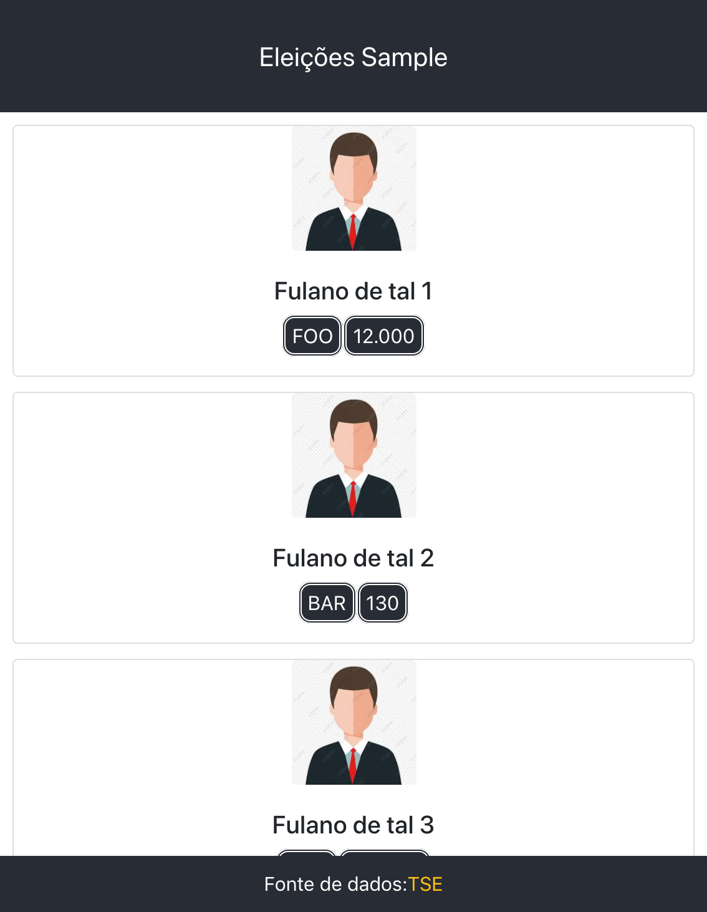
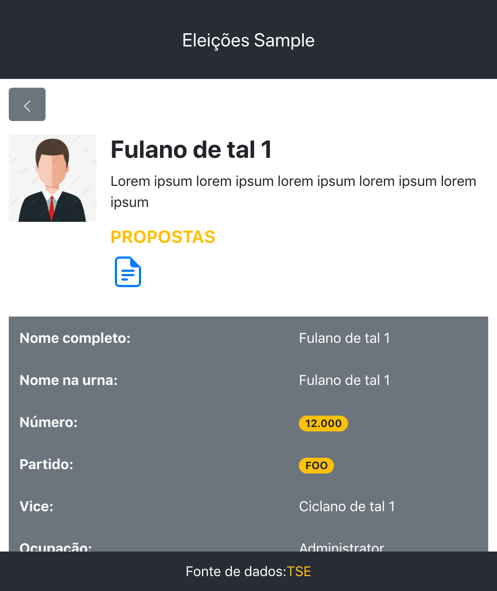

# election-candidates

Esse projeto gera uma visualização estática, atráves de uma páagina web, das informações dos candidatos a prefeito de uma determinada cidade. 

<div style="text-align:center">
  
</div>

## Como funciona

Para que a página possa ser gerada é necessário criar um arquivo `setup.js` dentro de algum diretório, também criado dentro do diretório `public` do projeto. Usar como modelo de dados necessários o modelo fornecido [aqui](public/sample/setup.js).

Os dados para preencher esse arquivo podem ser encontrados no site do [TSE](https://www.tse.jus.br/eleicoes/estatisticas/repositorio-de-dados-eleitorais-1/repositorio-de-dados-eleitorais).

OBS: o valor do campo `img` de cada `candidate` deve ser o caminho para algum arquivo de imagem do candidato, considerando o caminho a partir do diretório criado para conter o arquivo `setup.js`.

Após criar o arquivo `setup.js` basta fazer as configurações necessárias:

- Utilize a versão correta do `NodeJS`. Pode-se utilizar o `nvm` para isso:

```
nvm install
```

- Instale todas as dependências:

```
npm install
```

- Configure a variável de ambiente `REACT_APP_SETUP_PATH` para apontar para o caminho onde o arquivo setup.js se encontra a partir do diretório `public`.

Por exemplo, para usar o setup de modelo:

```
export REACT_APP_SETUP_PATH=sample
```

ou os dados dos candidatos da eleicão da cidade de Cataguases em 2020, também já fornecidos nesse projeto:

```
REACT_APP_SETUP_PATH=cataguases/2020
```

- Construa e sirva a página localmente:

```
npm start
```

- Quando todos os dados estiverem corretamente configurados, gere uma versão otimizada da página para ser hospedada na internet. É necessário hospedar todos os arquivo gerados no diretório `build`, após executar o seguinte comando:

```
npm run build
```

*Note*: This project was bootstrapped with [Create React App](https://github.com/facebook/create-react-app).